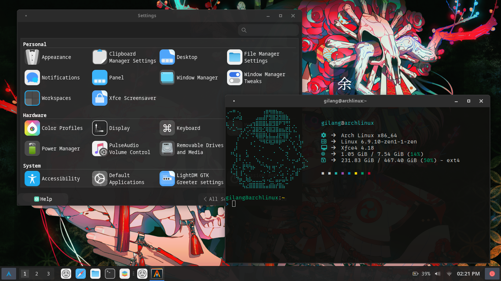

# XFCE Customize

This repository contains my personal customization for xfce desktop on Arch Linux.



## Setup

1. **Clone the Repository**

   ```sh
   git clone https://github.com/gilangarya01/xfce-customize.git
   ```

2. **Copy all folder to home**

   ```sh
   cd xfce-customize
   rm -rf .git README.md screenshot.png
   cp -a . ~/
   ```
